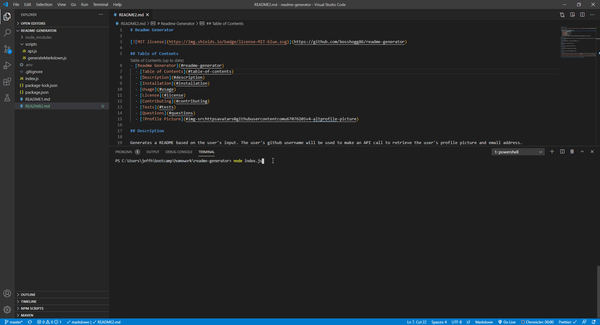

# Readme Generator

[](https://github.com/bosshogg86/readme-generator)

## Table of contents

  - [Description](#description)
  - [Installation](#installation)
  - [Usage](#usage)
  - [License](#license)
  - [Contributing](#contributing)
  - [Tests](#tests)
  - [Demo](#demo)
  - [Questions](#questions)

## Description

Generates a README based on the user's input. The user's github username will be used to make an API call to retrieve the user's profile picture and email address.

## Installation

To install dependencies, run the following command: 
```
npm i
```

## Usage

Requirements to use this project: node.js

## License

This project is licensed under the MIT license

## Contributing

To contribute to this project make a github pull request

## Tests

To run a test use the following command: 
```
npm test
```

## Demo

[](https://github.com/bosshogg86/readme-generator)

## Questions

If you have any questions you can contact me direct at <jeffhogg86@gmail.com>. Check out my other repositories at [bosshogg86](https://github.com/bosshogg86).

[](https://github.com/bosshogg86)

[](https://twitter.com/JeffHogg86)

## 
